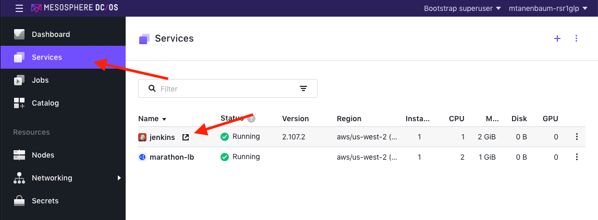
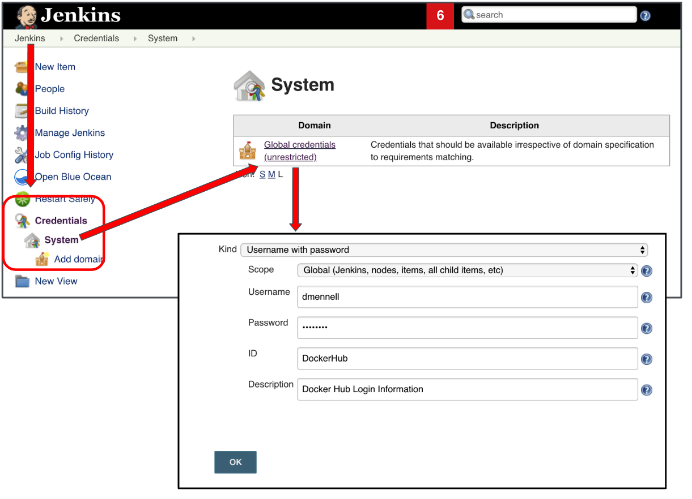
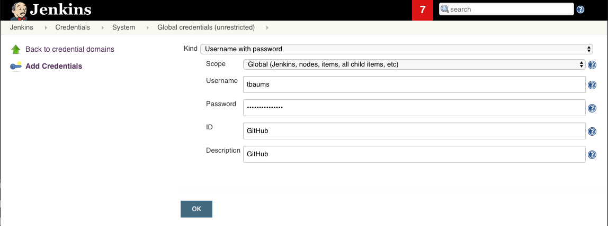
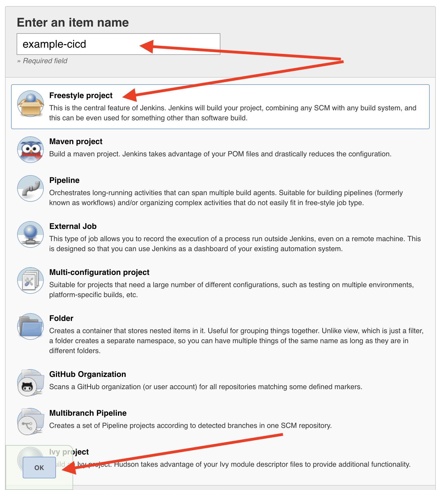
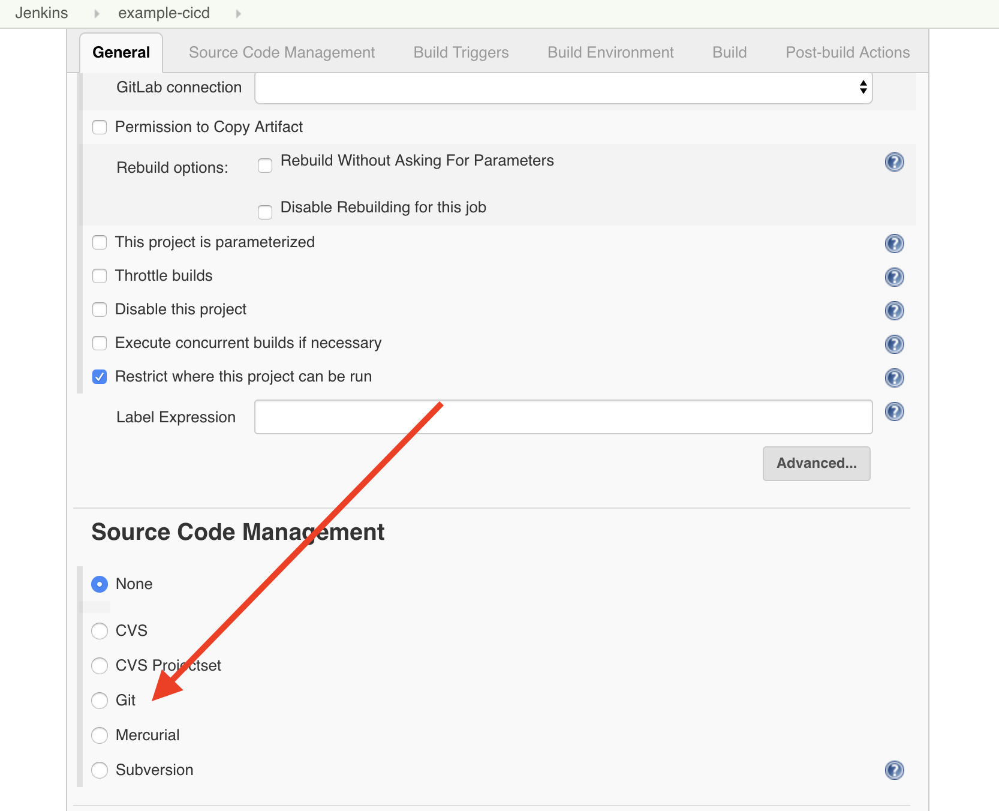
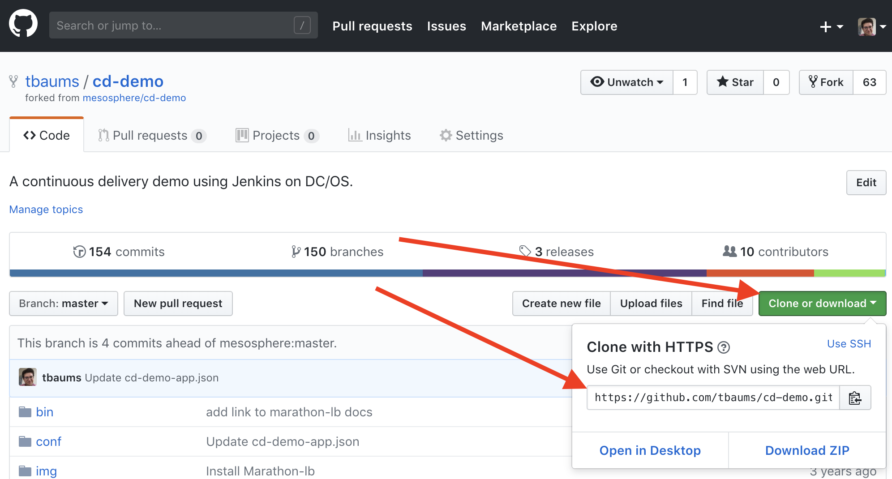
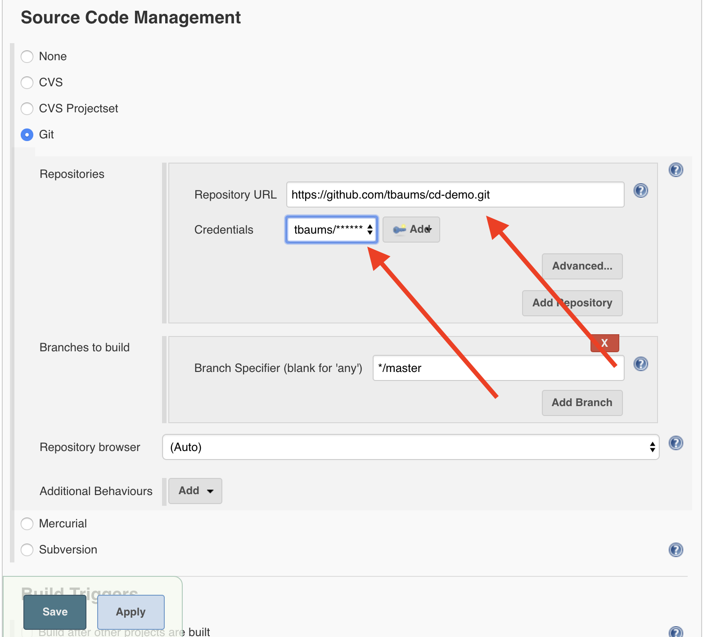
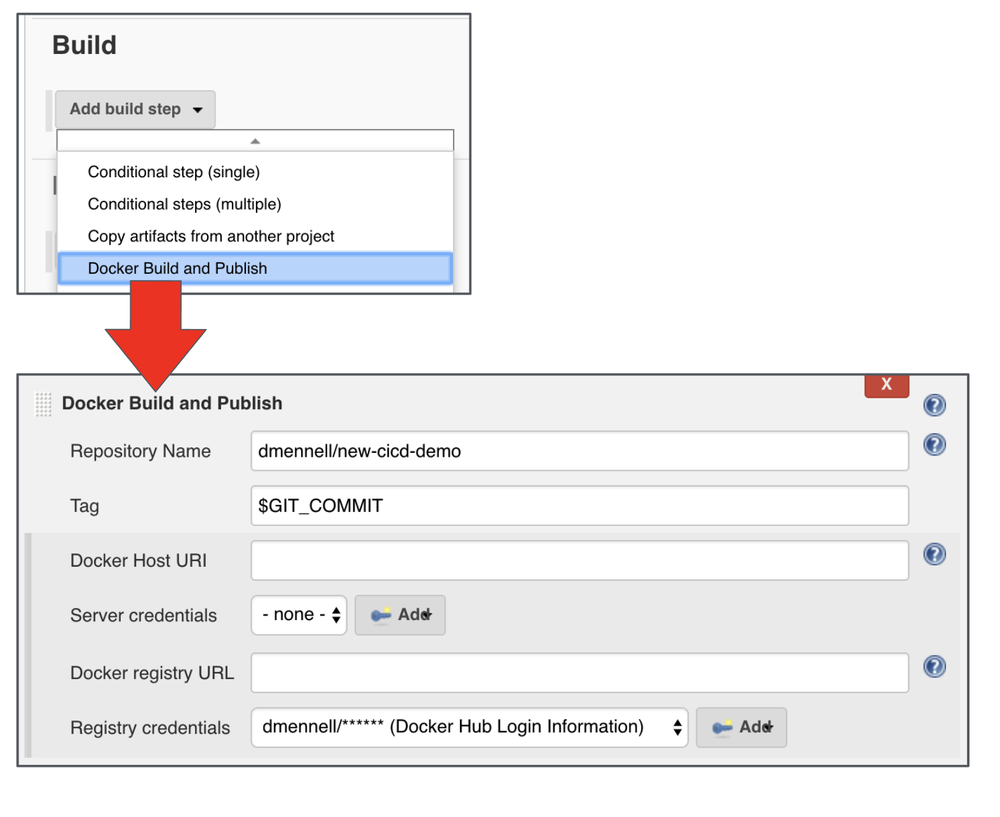
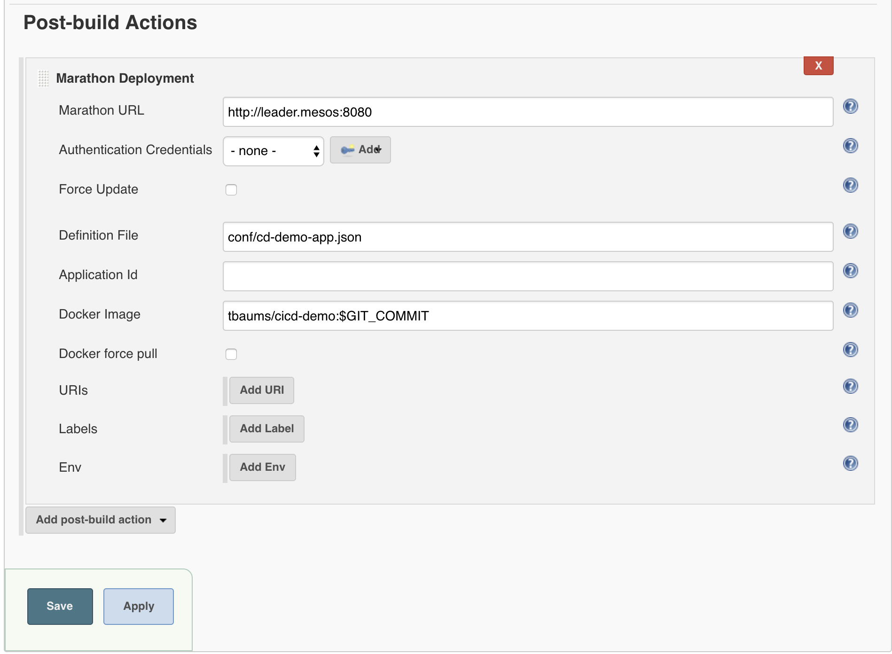

# Configure Jenkins

In this lab exercise, you configure your Jenkins instance to pull from GitHub, build a new Docker image with any code changes, push the Docker image to DockerHub, and deploy your application.

### Step 1
Navigate to your Jenkins UI

From your DC/OS Services tab, hover your mouse over the Jenkins icon and click the *open in new window* icon.

### Step 2
Add DockerHub credentials

From your Jenkins UI, select *Credentials*, then select *System*. Click *Global credentials*.

In the left navigation pane, select *Add Credentials*.

Add in your personal DockerHub credentials:
- Username: your personal DockerHub username (not email!)
- Password: your personal DockerHub password
- ID: `DockerHub`

When complete, click *OK*.

### Step 3
Add GitHub credentials

In the left navigation pane, select *Add Credentials*.

Add in your personal GitHub credentials:
- Username: your personal GitHub username (not email!)
- Password: your personal GitHub password
- ID: `GitHub`

When complete, click *OK*.

### Step 4
Create your Jenkins pipeline

Return to the Jenkins home screen by clicking the Jenkins logo in the top navigation bar.

Next, select *Create new jobs* from the Jenkins home screen.

Name your project anything you want (lowercase only, no spaces). Select *Freestyle project* and click *OK* at the bottom of the screen.

Now, you need to point Jenkins to the GitHub repository you forked in Lab 1.

Scroll down to the **Source Code Management** section of the page, and select *Git*.

In the *Repository URL* field, add the URL to your GitHub repository. You can find the URL to your repository by navigating to the repository on GitHub, selecting *Clone or Download* and copying the link, as shown.

Returning to Jenikns, paste your GitHub repository URL.

In the credentials selector, choose your GitHub credentials (which you provided to Jenkins in Step 3 above).

Scroll down the page to the *Build* section.

Select *Add build step* and choose *Docker Build and Push* from the dropdown.

Add in the following information:
- Repository name: `<your personal DockerHub username (not email!)>/cicd-demo`
- Tag: `$GIT_COMMIT`
- Registry credentials: Select the DockerHub credentials you created in Step 2 above.

Scroll down the page once more to the **Post-build Actions** section, and select *Add post-build action*.

From within the drop-down menu, select *Marathon Deployment* and click *Advanced*.

Add in the following information:
- Marathon URL: `http://leader.mesos:8080`
- Definition file: `conf/cd-demo-app.json`
- Docker Image: `<your personal DockerHub username (not email!)>/cicd-demo:$GIT_COMMIT`

When complete, click *Save*.

Congratulations! Your Jenkins build pipeline is now configured and ready to use!
