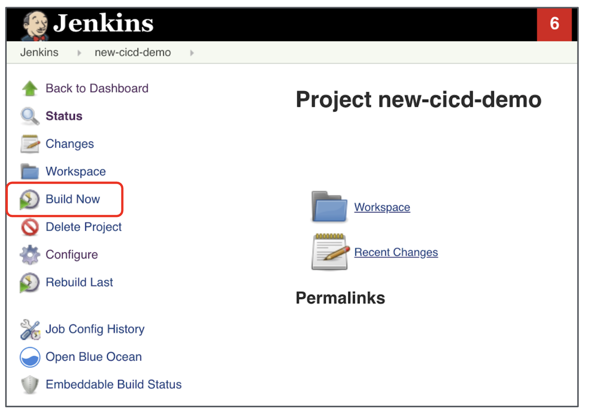
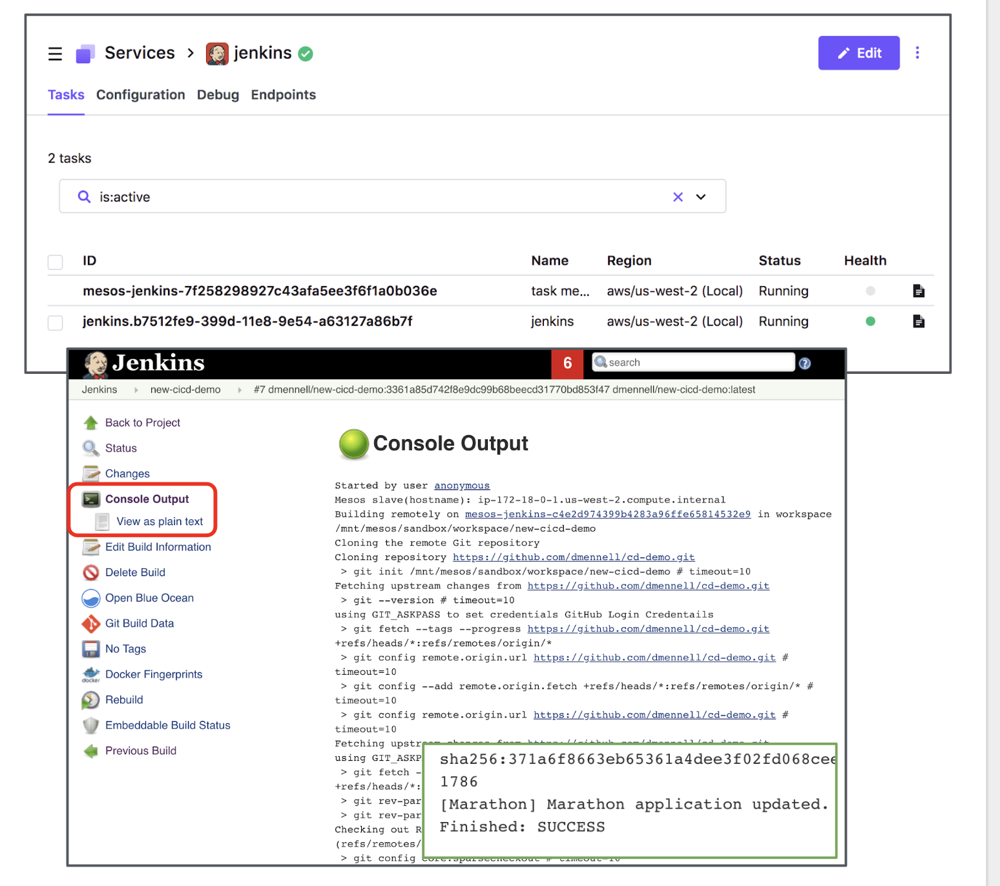

# Run your Jenkins Build!

With your fully configured Jenkins instance ready to pull from GitHub, push to DockerHub, and deploy your Dockerized application, it's time for a test drive!

### Step 1
Kick off Jenkins job

From the Jenkins home screen, click *Build Now* from the left navigation pane.

### Step 2
Observe your build process

You can observe the progress of your Jenkins pipeline by clicking the build and selecting *Console output*.

You can also observe DC/OS spinning up a new Jenkins executor to execute the pull/build/push process from the Jenkins service page within your DC/OS UI.

### Step 3
Observe application deployed to DC/OS!

Visit the services tab in your DC/OS UI and note the launched containerized application!
