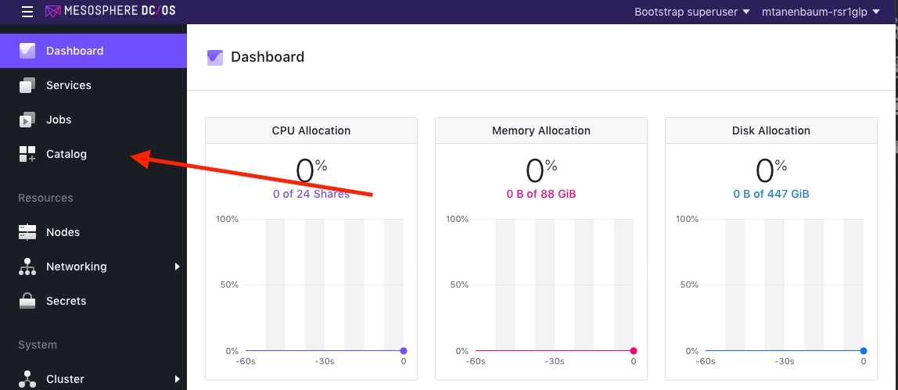
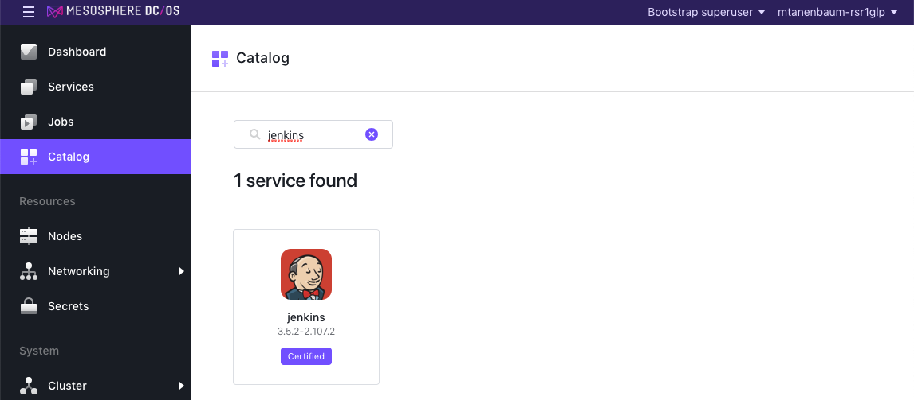
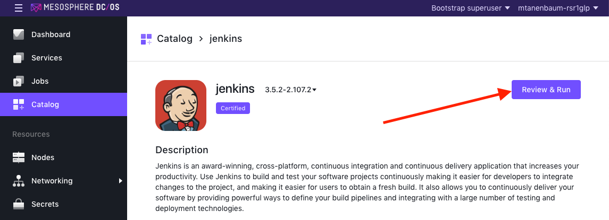
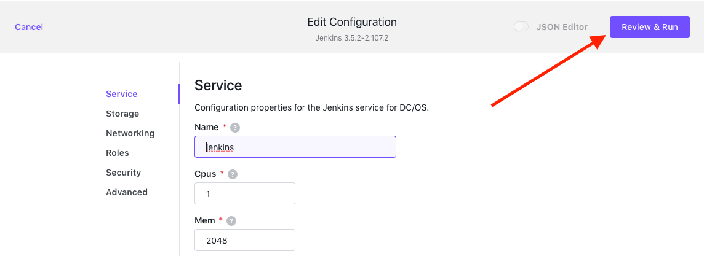
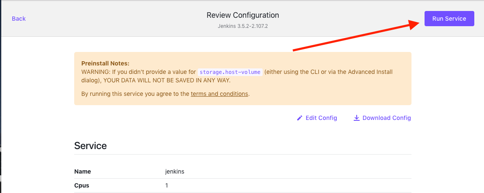
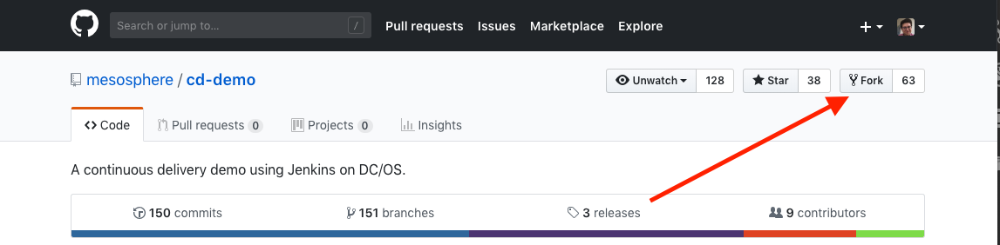

# Lab 1 - Environment Setup

### Step 1
Install Jenkins on DC/OS

Within your DC/OS UI, select *Catalog* in the left navigation pane.

Select Jenkins from the list of certified packages.

Select *Review & Run*.

You do not need to change the default configuration settings. Click *Review & Run* again.

Lastly, click *Run Service* to initiate your Jenkins deployment.

You can monitor the Jenkins launch process in your DC/OS Services tab.

### Step 2
Clone the `cd-demo` repository

Our Jenkins instance will need a GitHub repository to monitor for changes.

Please sign in to GitHub.com and navigate to https://github.com/mesosphere/cd-demo.

Once on the `cd-demo` repository homepage, select *Fork* in the upper righthand corner of the page.

You should now see the forked repository in your GitHub account.
