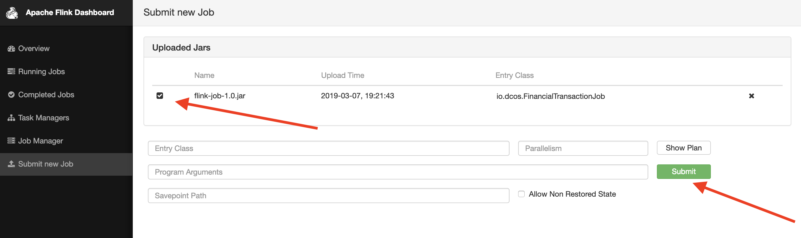

# Deploy Flink Job

### Step 1
Download FinancialTransactionJob

The core piece of this lab exercise is the [FinancialTransactionJob](https://github.com/dcos/demos/tree/master/flink/1.11/flink-job/src/main/java/io/dcos) which we will submit to Flink.

First, we need to upload the jar file into Flink. Please note that the jar file is too large to be included in this GitHub repo, but can be downloaded [here](https://downloads.mesosphere.com/dcos-demo/flink/flink-job-1.0.jar).


### Step 2
Upload and submit FinancialTransactionJob to Flink

In the Services tab of the DC/OS UI, hover over the name of the Flink service. Click the pop out icon which appears to the right of the Flink service listing. This will open the Flink web UI in a new tab.

In the Flink web UI, click on Submit New Job, then click the Add New button. This will allow you to select the jar file and upload it.


One the jar file is uploaded, we select it and hit Submit.  We should see the job begin to run in the Flink web UI.



### Step 3
Viewing Output

Now that we have the Flink job is running, we only need a way to visualize the results.

We do that with another [simple GoLang app](https://github.com/dcos/demos/blob/master/flink/1.11/actor/actor_viewer.go) and again we will deploy this microservice using kubernetes using the [flink-demo-actor.yaml](https://github.com/dcos/demos/blob/master/flink-k8s/1.11/actor/flink-demo-actor.yaml) deployment definition:

```
kubectl apply -f https://raw.githubusercontent.com/dcos/demos/master/flink-k8s/1.11/actor/flink-demo-actor.yaml
```
We can check the status of the deployment:

```
kubectl get deployments
kubectl get pods
```

We can also view the log output to make we are detecting fraud as expected (you will need to use the actual pod id from the previous command):

```
kubectl logs flink-demo-actor--655890656-8d1ls

Detected Fraud:   TransactionAggregate {startTimestamp=0, endTimestamp=1520473325000, totalAmount=23597:
Transaction{timestamp=1520473023000, origin=3, target='7', amount=5857}
Transaction{timestamp=1520473099000, origin=3, target='7', amount=7062}
Transaction{timestamp=1520473134000, origin=3, target='7', amount=9322}
Transaction{timestamp=1520473167000, origin=3, target='7', amount=921}
Transaction{timestamp=1520473325000, origin=3, target='7', amount=435}}

Detected Fraud:   TransactionAggregate {startTimestamp=0, endTimestamp=1520473387000, totalAmount=47574:
Transaction{timestamp=1520472901000, origin=0, target='2', amount=6955}
Transaction{timestamp=1520472911000, origin=0, target='2', amount=4721}
Transaction{timestamp=1520472963000, origin=0, target='2', amount=3451}
Transaction{timestamp=1520473053000, origin=0, target='2', amount=9361}
Transaction{timestamp=1520473109000, origin=0, target='2', amount=5306}
Transaction{timestamp=1520473346000, origin=0, target='2', amount=4071}
Transaction{timestamp=1520473365000, origin=0, target='2', amount=3974}
Transaction{timestamp=1520473387000, origin=0, target='2', amount=9735}}

Detected Fraud:   TransactionAggregate {startTimestamp=0, endTimestamp=1520473412000, totalAmount=21402:
Transaction{timestamp=1520472906000, origin=2, target='3', amount=8613}
Transaction{timestamp=1520473004000, origin=2, target='3', amount=5027}
Transaction{timestamp=1520473050000, origin=2, target='3', amount=924}
Transaction{timestamp=1520473177000, origin=2, target='3', amount=1566}
Transaction{timestamp=1520473412000, origin=2, target='3', amount=5272}}
```
