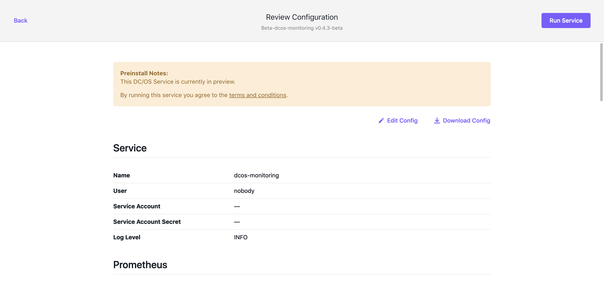
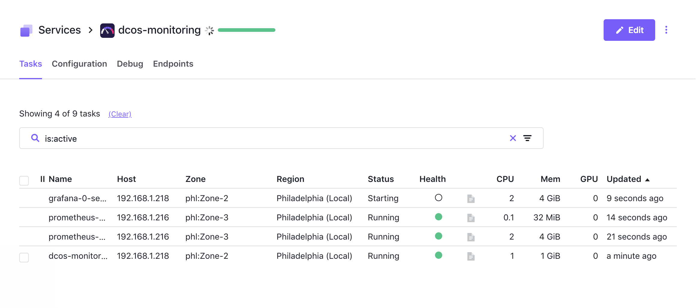

# Deploy DC/OS Monitoring Service

Note: These lab exercises assume you have a working DC/OS cluster and have successfully attached the DC/OS CLI to that cluster.

* DCOS-Monitoring is a monitoring package that includes preconfigured deployments of Prometheus and Grafanna along with some default Grafana dashboards.  DCOS-Monitoring will be deployed from the web GUI.  

* Kafka is a popular open source messaging service.  Kafka will be deployed via the command line.

## Deploy a DC/OS Framework Service From the GUI
In this section we are going to deploy the DC-OS monitoring service via the DC/OS web GUI.  DCOS-Monitoring is a great example of the community giving back.  It deploys Grafanna and Prometheus preconfigured to work together.  It also auto imports a selection of dashboards that to visualize the health of the DC/OS Cluster and Services running on DC/OS.

Step 1
Navigate to the dashboard of the DC/OS GUI within a supported browser:

`http://<Cluster-Master-IP-Address-or-Load-Balancer-Name>`

Step 2
With the window large enough to expose the tree view on the left side of the screen, click "Catalog".

You will be presented with a catalog of frameworks that can easily be deployed to DC/OS

Feel free to scroll through the screen to see all the different services that are avialable to deploy from the catalog.  Scroll to the top of the page and type "mon" into the "Search Box".  This will filter the visible Frameworks accordingly.  

Step 3
Find "beta-dcos-monitoring" and click it.

You will be presented with the initial configuration screen for the "beta-dcos-monitoring" Service.  Here you can select the version of the service you would like to deploy.  

Step 4
From the pull-down menu, select v0.4.3-beta

Step 5
Click "Review and Run" This will expose the "Edit Configuration" screen.

By clicking the links on the left, you expose advanced configuration and resource allocation options for the different monitoring components: Prometheus, Grafanna, and Alert Manager.  For this exercise we are going to use the default entries.  Click the "JSON editer" slider to see how the JSON entries map to the entries in the gui.

Step 6
Click "Review and Run"

Here you can give your configuration one final review before deploying the service.  You can also click "Download Config" to download a copy of the JSON for manual modification, or inclusion in as CI/CD Pipeline.

Step 7
Click "Run Service"

If everything needed to deploy the service is there, you are presented with the "Success" call-out box.

Step 8
Click "Open Service"

This will begin the deployment of the dcos-monitoring service and take you to the service detail screen.  From here you can watch the progress of the dcos-monitoring service.

The first "Task" to be deployed is the scheduler.  The scheduler is responsible for the lifecycle of the service: deploys tasks, restarts failed tasks, and scales the tasks as desired.

Once the board is green, we can assume that the service is fully deployed as all tasks are passing health checks.  In some cases, the service may take a few additional moments for the service to complete its start

As the DC/OS Monitoring service takes advantage of the DC/OS Admin Router, we can go directly to the respective dashboards for Prometheus and Grafana by accessing the below URL's.

`https://<CLUSTER_URL>/service/dcos-monitoring/grafana/`

`https://<CLUSTER_URL>/service/dcos-monitoring/prometheus`
